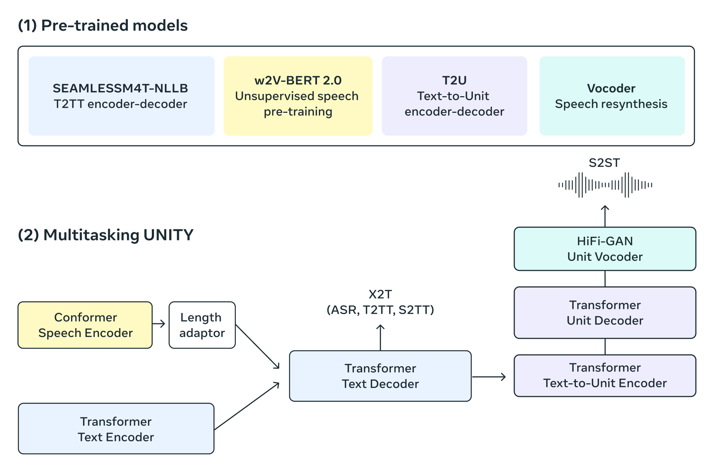

# Fast SeamlessM4T ONNX
ONNX-compatible SeamlessM4T—Massively Multilingual & Multimodal Machine Translation for ONNXRuntime (WIP).

<p align="center"><br><em>SeamlessM4T is designed to provide high quality translation, allowing people from different linguistic communities to communicate effortlessly through speech and text.</em></p>

# TODO

- [x] Text Encoder
- [ ] Speech Encoder
- [ ] Generator (Beam Search) - looks like this is too dynamic (`fairseq`'s `Seq2SeqGenerator`)
- [ ] Text Decoder - difficult to make stateless (blocked by `IncrementalStateBag`)
- [ ] Unit Encoder
- [ ] Unit Decoder
- [ ] Vocoder

# Notes

- Currently requires pytorch-nightly reinstall after installing seamless_communication.

# Credits

If you use any ideas from the papers or code in this repo, please consider citing the authors of [SeamlessM4T](https://arxiv.org/abs/2308.11596). Lastly, if the ONNX versions helped you in any way, please also consider starring this repository.

```bibtex
@article{seamlessm4t2023,
  title={SeamlessM4T—Massively Multilingual \& Multimodal Machine Translation},
  author={{Seamless Communication}, Lo\"{i}c Barrault, Yu-An Chung, Mariano Cora Meglioli, David Dale, Ning Dong, Paul-Ambroise Duquenne, Hady Elsahar, Hongyu Gong, Kevin Heffernan, John Hoffman, Christopher Klaiber, Pengwei Li, Daniel Licht, Jean Maillard, Alice Rakotoarison, Kaushik Ram Sadagopan, Guillaume Wenzek, Ethan Ye,  Bapi Akula, Peng-Jen Chen, Naji El Hachem, Brian Ellis, Gabriel Mejia Gonzalez, Justin Haaheim, Prangthip Hansanti, Russ Howes, Bernie Huang, Min-Jae Hwang, Hirofumi Inaguma, Somya Jain, Elahe Kalbassi, Amanda Kallet, Ilia Kulikov, Janice Lam, Daniel Li, Xutai Ma, Ruslan Mavlyutov, Benjamin Peloquin, Mohamed Ramadan, Abinesh Ramakrishnan, Anna Sun, Kevin Tran, Tuan Tran, Igor Tufanov, Vish Vogeti, Carleigh Wood, Yilin Yang, Bokai Yu, Pierre Andrews, Can Balioglu, Marta R. Costa-juss\`{a} \footnotemark[3], Onur \,{C}elebi,Maha Elbayad,Cynthia Gao, Francisco Guzm\'an, Justine Kao, Ann Lee, Alexandre Mourachko, Juan Pino, Sravya Popuri, Christophe Ropers, Safiyyah Saleem, Holger Schwenk, Paden Tomasello, Changhan Wang, Jeff Wang, Skyler Wang},
  journal={ArXiv},
  year={2023},
  eprint={2308.11596},
  archivePrefix={arXiv},
  primaryClass={cs.CL}
}
```
